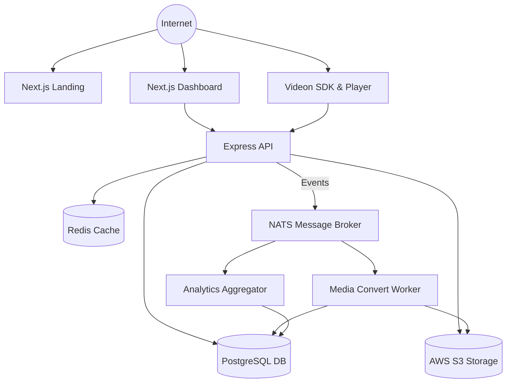

<div align="center">
  <br />
  <a href="https://videon.com">
    
  </a>
  <br />

  <h1 align="center" style="font-size: 48px;">Videon</h1>

  <p align="center">
    <strong>The Open-Source, AI-Powered Video Hosting & Streaming Infrastructure.</strong>
  </p>

  <p align="center">
    <a href="https://github.com/sanjeev0303/Videon/blob/main/LICENSE"></a>
    
    
    
    
    
    
    
  </p>

  <p align="center">
    
    
  </p>

</div>

---

<!-- Large Banner Image Placeholder -->
<div align="center">
  
</div>

---

## 🌟 Introduction

Building modern video streaming applications is notoriously difficult. Transcoding, adaptive bitrate streaming (HLS/DASH), content delivery, player customization, and analytics require cobbling together disparate cloud services and managing complex, fragile pipelines.

**Videon** solves this by providing a complete, developer-first, open-source video infrastructure platform. Designed for production scale, it gives you everything you need to ingest, process, stream, and monetize video content—without the headache of maintaining complex media pipelines.

Whether you are building the next YouTube, an enterprise internal learning management system, or integrating rich media into your SaaS, Videon provides the building blocks.

---

## 🚀 Why Videon?

<details open>
<summary><b>View Features</b></summary>
<br/>

| Feature | Description |
| :--- | :--- |
| ⚡ **Lightning Fast** | Built on Edge-ready architecture using Redis caching, CDN distribution, and optimized Postgres queries. |
| 📈 **Scalable** | Cloud-native, Docker-ready, and horizontally scalable event-driven processing via NATS. |
| 🧑‍💻 **Developer Friendly** | Fully typed SDKs, predictable REST APIs, and a beautifully documented developer experience. |
| 📊 **Advanced Analytics** | Built-in telemetry for geo-analytics, bandwidth usage, revenue tracking, and engagement metrics. |
| 🎬 **Adaptive Streaming** | Dynamic HLS generation for seamless playback across all devices and varying network conditions. |
| 🔐 **Authentication** | Secure token-based access with Clerk, JWT, and fine-grained API Key controls. |
| 💳 **Payments & Billing** | Integrated Stripe billing for usage-based models, SaaS tiers, and monetization. |
| 🔌 **API First** | Built as a headless architecture, allowing you to bring your own frontend or use our React SDK. |

</details>

---

## 📸 Screenshots

<div align="center">
  <table>
    <tr>
      <td></td>
      <td></td>
    </tr>
    <tr>
      <td></td>
      <td></td>
    </tr>
  </table>
</div>

---

## 🏗 Architecture Diagram

Our backend follows a highly available, event-driven microservices approach utilizing NATS for message passing and worker delegation.



---

## 📁 Monorepo Structure

Videon uses a modern monorepo architecture leveraging `pnpm` workspaces for seamless local development and dependency sharing.

```text
videon/
├── apps/
│   ├── landing/              # Next.js 16 - Marketing & Landing Page
│   ├── main-dashboard/       # Next.js 16 - User Dashboard & Portal
│   ├── server/               # Express.js - Core API, Transcoding & Analytics
│   └── sdk/                  # TypeScript SDKs
│       ├── videon-player/    # React Player SDK (Powered by Vidstack)
│       └── videon-sdk/       # Core JavaScript API SDK
├── packages/                 # (Shared local packages - UI, Config)
├── docker-compose.yml        # Local infrastructure definition
├── package.json              # Root workspace definitions
└── README.md
```

---

## 💻 Tech Stack

### Frontend Architecture
| Technology | Role |
| :--- | :--- |
| **Next.js 16** | React framework with App Router, SSR, and RSC. |
| **React 19** | UI rendering library. |
| **TailwindCSS v4** | Utility-first CSS styling. |
| **shadcn/ui & Radix** | Accessible, unstyled UI component primitives. |
| **React Query** | Asynchronous state management and data fetching. |
| **Framer Motion** | Complex UI animations and transitions. |
| **Recharts** | Composable charting for analytics dashboards. |
| **Vidstack** | Core video player framework under the hood of `@videon/player`. |

### Backend & Infrastructure
| Technology | Role |
| :--- | :--- |
| **Express.js** | High-performance API routing and middleware. |
| **Prisma ORM** | Type-safe database client and schema management. |
| **PostgreSQL** | Primary relational datastore. |
| **Redis** | High-speed caching for rate limits, API keys, and session data. |
| **NATS** | Lightweight, high-performance messaging system for event-driven workers. |
| **AWS S3** | Object storage for raw media and transcoded HLS chunks. |
| **OneMinuteCloud** | Managed video processing and transcoding infrastructure. |
| **Node Cron** | Scheduled jobs for billing syncs, analytics rollups, and cleanup. |

### Integrations
| Provider | Role |
| :--- | :--- |
| **Clerk** | Secure identity, authentication, and user management. |
| **Stripe** | Subscription billing, usage metering, and invoice management. |

---

## ✨ Features

| Feature | Status | Description |
| :--- | :---: | :--- |
| **Video Upload** | ✅ | Direct-to-S3 multipart uploads for massive files. |
| **Video Processing** | ✅ | Automatic webhook-based transcoding to HLS format. |
| **Adaptive Playback** | ✅ | Smart resolution switching based on network conditions. |
| **Analytics Dashboard** | ✅ | Real-time views on bandwidth, watch time, and geo-data. |
| **Billing & Payments** | ✅ | Automated subscription handling with Stripe. |
| **Player Branding** | ✅ | Customizable watermarks, colors, and player controls. |
| **Playlists** | ✅ | Group videos into embeddable, continuous playlists. |
| **API Keys** | ✅ | Secure, revocable API access for developers. |
| **Authentication** | ✅ | Enterprise-grade auth flows via Clerk. |
| **Storage Management**| ✅ | Quota tracking and automated file lifecycle management. |

---

## 🏁 Getting Started

### Prerequisites

Ensure you have the following installed on your local development machine:

- **Node.js** (v18 or higher)
- **pnpm** (v8 or higher)
- **Docker** and **Docker Compose**
- **Git**

### Installation

1. **Clone the repository:**
   ```bash
   git clone https://github.com/sanjeev0303/Videon.git
   cd Videon
   ```

2. **Install dependencies:**
   ```bash
   pnpm install
   ```

3. **Set up local infrastructure (Databases, Redis, NATS):**
   ```bash
   docker-compose up -d
   ```

4. **Environment Configuration:**
   Copy the example environment files for each app.
   ```bash
   cp apps/server/.env.example apps/server/.env
   cp apps/main-dashboard/.env.example apps/main-dashboard/.env
   cp apps/landing/.env.example apps/landing/.env
   ```
   *(See [Environment Variables](#-environment-variables) for required configuration).*

5. **Run database migrations:**
   ```bash
   cd apps/server
   npx prisma migrate dev
   ```

6. **Start the development servers:**
   ```bash
   # From the root directory
   pnpm run dev
   ```

This will concurrently start the Server, Landing Page, and Main Dashboard.

---

## 🔑 Environment Variables

<details>
<summary>Click to view comprehensive environment variables</summary>
<br/>

### Global / Server (`apps/server/.env`)

| Variable | Type | Description |
| :--- | :--- | :--- |
| `DATABASE_URL` | String | PostgreSQL connection string. |
| `REDIS_URL` | String | Redis connection string. |
| `NATS_URL` | String | NATS server connection string. |
| `PORT` | Number | Server port (Default: `8080`). |
| `JWT_SECRET` | String | Secret for signing API and Player JWTs. |
| `CLERK_SECRET_KEY` | String | Clerk Backend Secret Key. |
| `STRIPE_SECRET_KEY` | String | Stripe Secret Key. |
| `STRIPE_WEBHOOK_SECRET` | String | Stripe Webhook Secret for validation. |
| `AWS_ACCESS_KEY_ID` | String | AWS credentials. |
| `AWS_SECRET_ACCESS_KEY` | String | AWS credentials. |
| `AWS_REGION` | String | Target AWS region. |
| `AWS_S3_BUCKET` | String | Primary S3 bucket for video storage. |
| `OMC_API_KEY` | String | OneMinuteCloud transcoding API Key. |

### Dashboards (`apps/landing/.env`, `apps/main-dashboard/.env`)

| Variable | Type | Description |
| :--- | :--- | :--- |
| `NEXT_PUBLIC_CLERK_PUBLISHABLE_KEY` | String | Clerk Frontend Key. |
| `CLERK_SECRET_KEY` | String | Clerk Backend Key. |
| `NEXT_PUBLIC_API_URL` | String | Base URL for the Videon Server API. |
| `NEXT_PUBLIC_STRIPE_PUBLIC_KEY` | String | Stripe Publishable Key. |

</details>

---

## 🐳 Docker Deployment

Videon is designed to be cloud-native and easily deployable via Docker.

### Local Development
```bash
docker-compose up -d
```
Spins up PostgreSQL, Redis, and NATS.

### Production
For production, we recommend deploying the Node.js applications as independent containers orchestrated by Kubernetes, ECS, or Docker Swarm.

```bash
# Build the Server Image
docker build -t videon-server -f apps/server/Dockerfile .

# Build the Dashboard Image
docker build -t videon-dashboard -f apps/main-dashboard/Dockerfile .
```

> [!IMPORTANT]
> Ensure that Redis and NATS are highly available in your production environment to prevent message loss during transcoding jobs.

---

## 📚 API Documentation

Videon's REST API is designed around domains.

### Modules Available

- **`Authentication`**: Handled via Clerk JWT validation.
- **`Videos`**: Manage video metadata, soft deletes, and fetching.
- **`Uploads`**: Request pre-signed S3 URLs for direct client uploads.
- **`Analytics`**: Fetch aggregate event data for dashboards.
- **`Billing`**: Manage Stripe sessions and usage quotas.
- **`Branding`**: Update custom player watermarks and colors.
- **`Player`**: Fetch securely signed playback URLs and HLS manifests.
- **`Playlists`**: Manage grouped video collections.
- **`API Keys`**: Generate and revoke developer access tokens.

### Example: Fetching Analytics
```bash
curl -X GET https://api.videon.com/v1/analytics \
  -H "Authorization: Bearer YOUR_API_KEY"
```

---

## 📦 SDK & Player Integration

We provide an out-of-the-box React player built on top of Vidstack for maximum compatibility and performance.

### Installation
```bash
npm install @videon/player @videon/sdk
```

### Usage (React)

```tsx
import { VideonPlayer } from "@videon/player";
import "@videon/player/styles.css";

export default function VideoPage() {
  return (
    <div className="w-full max-w-4xl mx-auto">
      <VideonPlayer
        videoTrackingId="vid_123456789"
        autoPlay={true}
        playsInline={true}
        onReady={() => console.log("Player is ready")}
        onError={(err) => console.error("Playback error", err)}
      />
    </div>
  );
}
```

---

## 🏗 Project Architecture Patterns

Our backend adheres to strict architectural patterns to maintain scalability:

- **Controller Layer**: Handles incoming HTTP requests, extracts parameters, and manages the HTTP response payload.
- **Service Layer**: Contains core business logic. Independent of HTTP contexts.
- **Repository Pattern**: Abstracts Prisma ORM logic. Controllers and Services never interact directly with the DB.
- **DTOs (Data Transfer Objects)**: Strictly types incoming payloads using Zod or custom interfaces before they hit the service layer.
- **Middleware**: Express middlewares for Auth, Logging, Rate Limiting (Redis), and Error Handling.
- **Event Consumers (NATS)**: Asynchronous workers listen for `video.uploaded` or `analytics.track` events to process without blocking the main event loop.
- **Scheduler**: Node Cron handles daily billing syncs and storage recalculations.

---

## 📊 Analytics

Videon tracks deep metrics without impacting playback performance by batching events and processing them asynchronously via NATS.

- **Geographical Maps**: View viewership density globally via mapped ISO codes.
- **Revenue**: Track usage-based billing costs dynamically.
- **Device & Browser**: Breakdown of platforms consuming your media.
- **Bandwidth**: Monitor total egress dynamically.

---

## 🔒 Security

> [!CAUTION]
> Videon takes security seriously. Private videos are protected via short-lived Signed JWTs.

- **Authentication**: JWTs validated against Clerk JWKS.
- **Input Validation**: All API inputs strictly parsed.
- **Database Security**: Prisma prevents SQL injection natively.
- **Rate Limiting**: Redis-backed limits on API endpoints to prevent DDoS.
- **CORS**: Strictly configured allowed origins.

---

## ⚡ Performance

- **Caching**: Heavy reliance on Redis for resolving User Plans, API Keys, and Configuration.
- **Database Queries**: Optimized index usage in Postgres.
- **Lazy Loading**: Next.js App Router heavily leverages React Suspense and dynamic imports.
- **Edge Delivery**: S3 origins fronted by CDN architectures for global edge delivery.

---

## 🗺 Roadmap

- [ ] Webhooks for developer consumption (e.g., `video.ready`).
- [ ] AI-Generated Video Chapters and Transcripts via Hugging Face.
- [ ] Advanced DRM (Digital Rights Management) Support.
- [ ] Multi-tenant White Labeling.
- [ ] Real-time Live Streaming (RTMP to HLS).

---

## 🤝 Contributing

We welcome contributions! Please see our [CONTRIBUTING.md](./CONTRIBUTING.md) for details on our code of conduct, and the process for submitting pull requests to us.

---

## 💅 Code Style

- **Linter**: ESLint + Prettier.
- **Language**: Strict TypeScript (`"strict": true` in `tsconfig.json`).
- **Conventions**:
  - Interfaces: Prefix with `I` (e.g., `IVideoService`).
  - Files: `kebab-case.ts`.
  - Folders: Grouped by module domain (e.g., `/src/modules/billing`).

---

## 📝 License

This project is licensed under the MIT License - see the [LICENSE](LICENSE) file for details.

---

## 👥 Maintainers

- [sanjeev0303](https://github.com/sanjeev0303) - *Core Maintainer*

---

## 💬 Support

If you need help, please:
1. Open an issue on [GitHub Issues](https://github.com/sanjeev0303/Videon/issues)
2. Join our community [Discord Server](#)
3. Email support at [support@videon.com](mailto:support@videon.com)

---

## 🙏 Acknowledgements

Videon stands on the shoulders of open-source giants:

- [Next.js](https://nextjs.org/)
- [Prisma](https://www.prisma.io/)
- [Clerk](https://clerk.com/)
- [Tailwind CSS](https://tailwindcss.com/)
- [Vidstack](https://vidstack.io/)
- [AWS](https://aws.amazon.com/)

---
<div align="center">
  <sub>Built with ❤️ by developers, for developers.</sub>
</div>
